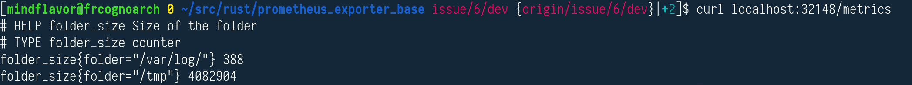

# Rust Prometheus exporter base

### Rust base library for Prometheus exporters


[](LICENSE)

[](https://github.com/MindFlavor/prometheus_exporter_base/releases/tag/1.1.0)
[](https://img.shields.io/github/commits-since/mindflavor/prometheus_exporter_base/1.1.0.svg)

[](https://crates.io/crates/prometheus_exporter_base) [](https://crates.io/crates/prometheus_exporter_base) [](https://crates.io/crates/prometheus_exporter_base)

## Goal

This crate is meant to make writing a proper Prometheus exporter with a minimal effort. 
It gives you two things.

1. A Rust-y, fluent way to create Prometheus compliant outputs:

```rust 
PrometheusMetric::build()
     .with_name("folder_size")
     .with_metric_type(MetricType::Counter)
     .with_help("Size of the folder")
     .build()
     .render_and_append_instance(
         &PrometheusInstance::new()
             .with_label("folder", "/var/log")
             .with_value(total_size_log)
             .with_current_timestamp()
             .expect("error getting the UNIX epoch"),
     )
     .render()
 ```
 
2. It optionally gives you a boilerplate-free Hyper server for exposing your Prometheus metrics. It handles most mundane tasks, such as setting up an Hyper server and doing some basic checks (such as rejecting anything but `GET` and responding only to the `/metrics` suffix) so all you have to do is supply a Boxed future that will handle your logic (remember to specify the `hyper_server` feature flag in your `Cargo.toml` as well). 

I use it on these crates: [prometheus_wireguard_exporter](https://github.com/MindFlavor/prometheus_wireguard_exporter) and [prometheus_iota_exporter](https://github.com/MindFlavor/prometheus_iota_exporter) so please refer to these crates if you want to see a real-world example. More simple examples are available in the [examples](https://github.com/MindFlavor/prometheus_exporter_base/tree/master/examples) folder.

## Usage 

### PrometheusMetric

The `PrometheusMetric` struct is used by instantiating it and then "rendering" the header and values - optionally specifying labels. This is an example taken from the documentation: 

```rust
PrometheusMetric::build()
     .with_name("folder_size")
     .with_metric_type(MetricType::Counter)
     .with_help("Size of the folder")
     .build()
     .render_and_append_instance(
         &PrometheusInstance::new()
             .with_label("folder", "/var/log")
             .with_value(total_size_log)
             .with_current_timestamp()
             .expect("error getting the UNIX epoch"),
     )
     .render()
```

This will give you something like this: 



For a more complete example please refer to the [examples](https://github.com/MindFlavor/prometheus_exporter_base/tree/master/examples) folder.

### Hyper server

To use Hyper server all you have to do is specify the `hyper_server` feature flag and call the `render_prometheus` function. This function requests you to pass: 

1. The address/port to listen to. For example `([0, 0, 0, 0], 32221).into()` listens on every interface on port 32221.
2. An arbitrary struct to be passed back to your code (useful for command line arguments). If you don't need it, pass an empty struct.
3. The *code* your exporter is supposed to do. This takes the form of a closure returning a boxed future. The closure itself will receive the http request data along with the aforementioned struct (point 2). The output is expected to be a string.

For example: 

```rust
render_prometheus(addr, MyOptions::default(), |request, options| {
    async {
    	Ok("it works!".to_owned())
    }
}).await;
```

As you can see, in order to keep things simple, the Hyper server does not enforce anything to the output. It's up to you to return a meaningful string by using the above mentioned structs. 

## Testing

Once running, test your exporter with any GET enabled tool (such as a browser) at `http://127.0.0.1:<your_exporter_port>/metric`.

## License 

Please see the [LICENSE](https://github.com/MindFlavor/prometheus_exporter_base/blob/master/LICENSE) file (spoiler alert: it's MIT).
